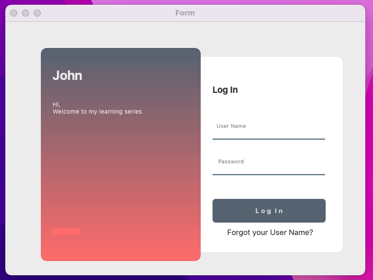

# PyQt5 Login UI

## Overview
This project is a simple login user interface built using PyQt5. It serves as an educational tool for understanding PyQt5's GUI components and styling through Qt Designer. The application features a clean layout with user-friendly elements for entering a username and password.



## Features
- A modern and responsive login form.
- Username and password input fields.
- A stylish button to submit login credentials.
- Visual feedback when interacting with UI elements (e.g., button hover and press effects).
- A label for additional actions (e.g., forgot username).

## Requirements
- Python 3.x
- PyQt5

## Installation
1. Clone the repository or download the source code:
   ```bash
   git clone https://github.com/yourusername/PyQt5_LoginUI.git
   ```
2. Navigate to the project directory:
   ```bash
   cd PyQt5_LoginUI
   ```
3. Install the required packages using pip:
   ```bash
   pip install PyQt5
   ```

## Usage
1. Run the application:
   ```bash
   python loginUi2.py
   ```
2. The login window will appear. Enter your username and password in the respective fields and click the **Log In** button.

## Code Overview
The code is generated from a `.ui` file created using Qt Designer. It consists of a main class `Ui_Form` which sets up the UI elements, such as:
- Labels for text and titles.
- Line edits for user input (username and password).
- A button for submission.
- Style sheets to customize the appearance of buttons and backgrounds.

### Command to conver .ui into .py 
- pyuic5 -x loginUi2.ui -o loginUi2.py 

### Main Components
- `QLabel`: Used for displaying text and titles.
- `QLineEdit`: Input fields for username and password. The password field is masked for privacy.
- `QPushButton`: A button for submitting the form.
- Custom styling is applied using Qt Style Sheets to enhance the visual appeal of the UI.

### Important Methods
- `setupUi`: Initializes the user interface components and layout.
- `retranslateUi`: Sets the text for UI elements, allowing for easy localization.

## Additional Notes
- The UI is designed to be visually appealing and functional. Feel free to customize it further according to your requirements.
- The project can serve as a base for more complex applications that require user authentication.

## Acknowledgments
- Thanks to the PyQt5 community for the resources and support.
- Inspired by various tutorials on PyQt5 UI design.

Happy coding!!